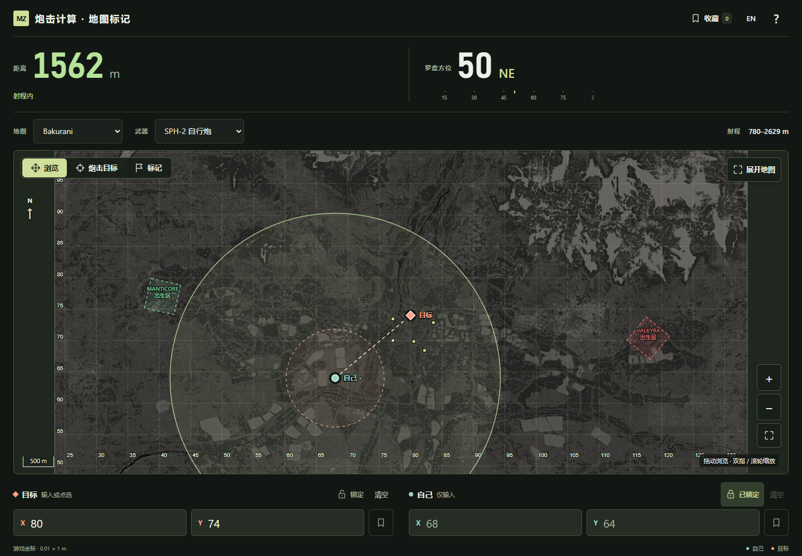
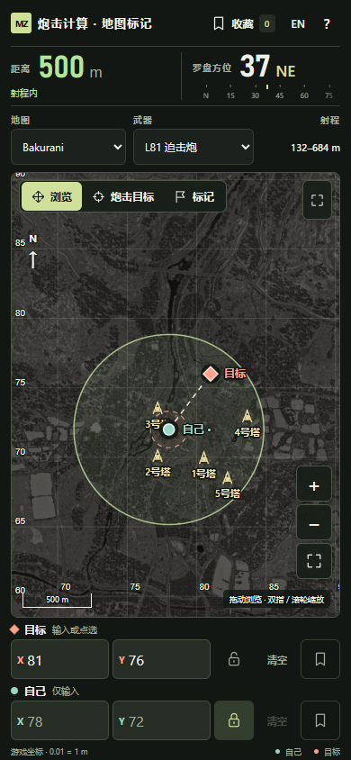
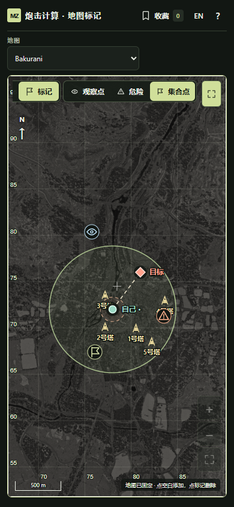

# 炮击计算 · 地图标记 | WARDOGS

手机优先的中英双语 WARDOGS 地图与距离工具。原生 HTML / CSS / JavaScript，无框架、构建步骤或运行时依赖。

地图标定、武器射程、塔位与出生区数据源自 [Apollyon](https://github.com/apollyon-sys) 的 [WARDOGS Artillery Calculator](https://github.com/apollyon-sys/wardogs-calculator)，地图瓦片取自其公开资源并随本仓库自托管。感谢作者的开源工作，完整引用见下方「致谢与来源」。

**[在线体验 →](https://mqzh.science/wdtool/)**

## 实际截图

桌面端：距离、罗盘方位与射程状态一目了然，地图同步显示自己、目标和最小 / 最大射程圈。



| 手机端 · 炮击计算 | 手机端 · 展开地图与标记 |
| --- | --- |
|  |  |

截图取自本项目实际运行界面（2026-09-14），使用示例坐标。地图影像归 BULKHEAD / 相应权利人所有，详见 [第三方声明](THIRD_PARTY_NOTICES.md)。

## 本地运行

```sh
python -m http.server 8000 --bind 127.0.0.1
# Open http://127.0.0.1:8000
node test.mjs
node scripts/vendor-maps.mjs --verify
```

仓库包含三张地图在可玩区域内所需的全部 0–7 级 WebP 瓦片：23,880 张，共约 685.5 MiB，无需从上游下载后才能运行。页面、代码与地图图片均从当前站点加载，支持本地断网运行；首次克隆或下载仓库需要网络。`--verify` 仅在本地检查瓦片覆盖范围、文件格式与 SHA-256，不访问网络。

## 使用

- 手机：结果 → 地图与武器 → 地图 → 目标 / 自己坐标。桌面坐标并排，目标在前。
- 浏览：鼠标拖动 / 单指拖动、滚轮 / 双指缩放；放置：固定地图，只点选目标。
- 塔作为独立标记叠加：Bakurani 5 座、Ozeti 4 座、Zestafona 3 座。缩小时显示淡黄色位置点，放大后显示塔图标和编号；不会改变自己的位置或放置模式规则。
- 三张地图均叠加 VALKYRA、MANTICORE、LONESTAR 出生区边界和名称，采用原站的出生区多边形。其余预设标记是阵营点、武器商店、车库商店与重生面板；本工具不重复添加这些标记，也不添加原站的手动战术标记库或等高线。
- 「标记」提供观察点、危险、集合点三种图标。该模式固定地图，点空白处连续添加，点已有标记删除；添加/删除均支持限时撤销。标记按地图保存在当前浏览器，独立于自己/目标坐标及其锁定状态；展开地图时也可使用。键盘聚焦地图后按 Enter 可在中心添加/删除标记。
- 自己的位置只从输入框或已收藏坐标载入，不接受地图点选。
- 独立锁定保护输入、清空与载入；自己的锁不会影响目标。换图保留各地图独立状态。
- 坐标使用游戏 X/Y：X 向东增加，Y 向北增加，0.01 = 1 m。支持小数点 / 小数逗号，最多两位小数；越界不截断、不用于计算。
- 平面距离以米显示；方位使用游戏 HUD 的整数角度 + 方向字母，如 `253 W`。北 0，东 90，南 180，西 270。同一点不显示虚假方位。
- 射程内绿色，过近 / 超射程红色，同时显示文字。实线最大射程圈、虚线最小射程圈以自己为中心。
- 「展开地图」收起计算与输入，保留位置与缩放；仍可选择地图。
- 收藏使用 localStorage（比 cookie 更适合不需要服务器的本地数据），按地图分类；可以命名、载入自己 / 目标、删除和限时撤销。清除网站数据会清除收藏。
- 键盘：地图聚焦后方向键平移，+/− 缩放；放置模式下 Enter 放在中心。原生对话框支持 Escape 关闭。

## 致谢与来源

> Apollyon (apollyon-sys). (2026). *WARDOGS Artillery Calculator* [计算机软件]. GitHub. 提交版本：[`ef7cf2d8cb637532b1595b634b87469be6f507b4`](https://github.com/apollyon-sys/wardogs-calculator/tree/ef7cf2d8cb637532b1595b634b87469be6f507b4)。访问日期：2026-09-14。

| 本项目使用的内容 | 上游来源与处理方式 |
| --- | --- |
| 地图坐标边界、瓦片标定、塔位和出生区多边形 | 来自该提交的 [maps/](https://github.com/apollyon-sys/wardogs-calculator/tree/ef7cf2d8cb637532b1595b634b87469be6f507b4/maps)，选取所需字段，塔位与多边形坐标从米换算为游戏坐标。 |
| L81 Mortar 与 SPH-2 的最小 / 最大射程 | 来自该提交的 [data/weapons.json](https://github.com/apollyon-sys/wardogs-calculator/blob/ef7cf2d8cb637532b1595b634b87469be6f507b4/data/weapons.json)，从千米换算为米。 |
| 地图瓦片 | 从上游地图配置中的 `assets.wardogs-artillery.com/releases/assets-v1/` 资源地址一次性取得，原样保存在 [assets/maps/](assets/maps/)，由本项目自己的站点按需提供。来源、下载时间和逐文件 SHA-256 见 [manifest.json](assets/maps/manifest.json)。 |

上游原创代码采用 [MIT License](https://github.com/apollyon-sys/wardogs-calculator/blob/ef7cf2d8cb637532b1595b634b87469be6f507b4/LICENSE)；版权声明与许可证全文保留在 [THIRD_PARTY_NOTICES.md](THIRD_PARTY_NOTICES.md)。WARDOGS 地图影像及其他游戏素材归 BULKHEAD / 相应权利人所有，不属于该 MIT 许可范围。

欢迎体验 Apollyon 的 [原站](https://wardogs-artillery.com/) 与 [移动端](https://wardogs-artillery.com/mobile/)，其中包含团队协作、弹道和更多地图工具。本项目聚焦距离、方位与地图标记，由本仓库维护者独立维护。

## 非官方与素材声明

本项目为独立维护的非官方玩家工具，不代表 BULKHEAD、WARDOGS 开发团队或 Apollyon，亦不声称获得其认可或背书。

WARDOGS 名称、商标、地图影像及其他游戏素材归各自权利人所有。页面与 README 截图中的相关素材用于展示本工具的游戏辅助功能，本项目不主张其所有权，也不对这些素材授予 MIT 或其他许可。

本仓库自托管地图图片，不改变其版权归属，也不将其纳入上游代码的 MIT 许可。本声明用于说明项目身份与素材归属，不替代相关权利人的授权。完整来源与上游许可证见 [第三方声明](THIRD_PARTY_NOTICES.md)。

## 数据与限制

| 地图 | 可用坐标 X | 可用坐标 Y |
| --- | --- | --- |
| Bakurani | 23.35–133.60 | 19.34–129.65 |
| Ozeti | 57.58–143.07 | 21.81–99.56 |
| Zestafona | 19.90–124.89 | 50.70–141.90 |

目前覆盖原站全部三张公开地图；不据此保证未来版本或轮换地图的完整性。三张地图使用相同 tileBounds：X −0.03–163.81、Y −0.01–163.83，与可玩坐标边界分别处理。

| 武器 | 社区参考射程 |
| --- | --- |
| L81 Mortar | 132–684 m |
| SPH-2 | 780–2629 m |

以上数据对应「致谢与来源」中引用的提交版本。这些是社区数据，不是开发商保证值；未做游戏内实测、地形修正或仰角计算。用户已取消爆炸 / 散布半径功能。

罗盘外观参考 [游戏 HUD 截图](https://wardogsgame.net/media/wardogs/field-05.jpg)（画面顶端为 `253 W`）及 [Steam 游戏页](https://store.steampowered.com/app/1867240/WARDOGS/)。采用同样的度数加字母格式，未复制 HUD 美术素材。

地图瓦片按当前可见区域从本站的 `./assets/maps/` 加载，运行时不请求上游图片服务器。浏览器缓存处理重复浏览；在线站点未预缓存的区域仍需连接本站，本地 HTTP 服务可完全断网使用。图片加载失败时显示可重试提示。归属见 [THIRD_PARTY_NOTICES.md](THIRD_PARTY_NOTICES.md)。

## 网站

在线地址：[WARDOGS Map & Range Tool](https://mqzh.science/wdtool/)。个人网站的部署流程读取本仓库并发布到此路径。更新后重新运行 personal-website 的 Publish website 工作流即可同步。

所有应用资源使用相对路径，支持在本地或其他子目录运行。

自托管时复制 `index.html`、`style.css`、`app.js`、`core.mjs`、`favicon.svg`、`THIRD_PARTY_NOTICES.md` 和完整的 `assets/maps/` 目录到任意静态 HTTP 服务即可。无需 API、上游 CDN、安装依赖或构建步骤。`scripts/vendor-maps.mjs` 是维护用的一次性下载器，正常使用与部署不需要运行；无参数执行会访问原始来源，跳过已经通过校验的文件。

## 已验证

`node scripts/vendor-maps.mjs --verify` 已核对全部 23,880 张瓦片的覆盖范围、WebP 文件格式与 SHA-256，并验证能拒绝被修改的图片。自托管浏览器检查在阻断外网请求的条件下覆盖三张地图、桌面与手机、逐级放大至最高精度及地图四角，738 次本站请求中外部请求为 0，无图片缺失或脚本错误。个人网站构建测试逐一检查部署目录中的瓦片文件与大小。

`node test.mjs` 检查四个正方向、3-4-5 距离、同点方位、360° 回绕、两种武器的射程边界、输入校验与屏幕坐标变换。浏览器检查覆盖三张地图、320×667 / 390×844 手机视口和桌面、双语、独立锁定、固定地图点选、收藏刷新持久化及地图隔离。手机视口检查不等于在实体 iOS / Android 设备上实测；双指触控仍建议在真机复核。

## Automatic website publishing

Pushes to `main` trigger the `personal-website` publishing workflow via `.github/workflows/publish-website.yml`. Configure the Actions secret `WEBSITE_PUBLISH_TOKEN` with a fine-grained token restricted to `Firepanda415/personal-website`, granting **Actions: Read and write**. Local commits take effect after pushing. Renew this secret when the token expires.
